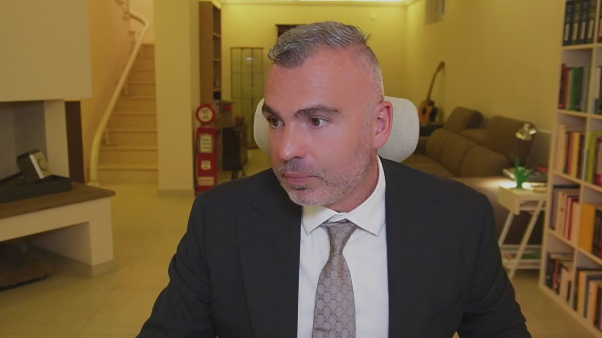
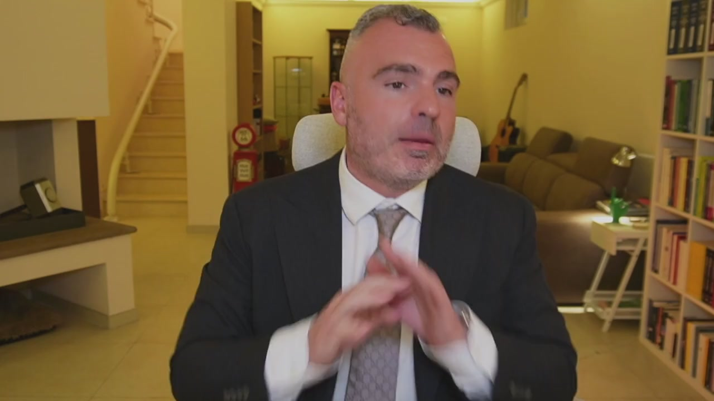
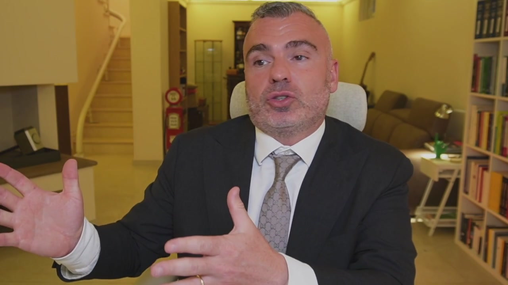

# 4. Fondo patrimoniale: come diventare inattaccabili

> Documento generato automaticamente: trascrizione e screenshot sincronizzati del video-corso.

## [00:00:00] Schermata 0 _(start)_

> Il fondo patrimoniale, invece, è molto interessante, se lo facciamo bene e nei tempi. Il fondo patrimoniale è doveroso in tante situazioni e quando ci sono imprenditori di mezzo. Il fondo patrimoniale è la costituzione di un vincolo su sostanzialmente beni immobili che i coniugi fanno per riservare quel singolo o quei singoli beni all'esigenza della famiglia. Ad esempio, io con mia moglie decido di destinare una, due o tre case e le loro rendite all'esigenza della famiglia. Lo faccio? Dopo 3, 4, 5, 6 anni ho dei problemi? Quei beni non sono attaccabili. Se io invece ho dei problemi e corro a riparo facendo il fondo patrimoniale, me lo revocano.

## [00:01:00] Schermata 1 _(periodic)_

> C'è pieno zeppo di sentenze dove i fondi patrimoniali vengono revocati perché il giudice diceva che era fatto solamente per fare una beffa ai creditori. No, amico? Allora, io siccome faccio pianificazione, io imprenditore, tu imprenditore, devi fare pianificazione, dici aspetta, ho un'attività imprenditoriale a rischio, ho tre case, due a rendita, più ce n'ho altre due di là, oppure ce n'ho una sola, la metto nel fondo patrimoniale. Costituisco il fondo patrimoniale così se in futuro ho dei problemi, quello non è attaccabile. Attenzione, perché qualora ci fossero dei figli minori, se io poi voglio vendere quell'immobile e il figlio è ancora minore, ho bisogno dell'autorizzazione del giudice tutelare per poter vendere, dimostrando che il provento di quella casa, di quella vendita, è destinato alle esigenze della famiglia, perché ad esempio magari compro una più grande.

## [00:02:00] Schermata 2 _(periodic)_

**Testo a schermo (OCR):** (O

> Ma se io dovessi vendere per altre finalità, il giudice non me la darà l'autorizzazione. Se i figli sono maggiori, il maggiorare non c'è problema. Se siete interessati al fondo patrimoniale, prendete una consulenza, ne parliamo, valutiamo, io ho diversi contatti con notari bravissimi sul fondo patrimoniale, possiamo veramente discuterne. Ad esempio, ho fatto recentemente un fondo patrimoniale dove c'erano di mezzo cinque case, tre in un comune dove c'era anche la residenza, quindi casa familiare più due case in un comune, altre due case a rendita in un altro comune. Ho deciso di fare un fondo patrimoniale mettendoci solamente quella di residenza più due, mentre ho lasciato fuori quelle dell'altro comune. Ho detto lasciamoli qualcosa, così se dovesse succedere qualcosa fra quattro o cinque anni non mi contestano che ci ho messo tutto dentro il fondo patrimoniale per proteggere tutto, imbeffa i creditori, ma due le lascio fuori.

## [00:03:00] Schermata 3 _(periodic)_

> Sono scelte che dobbiamo fare, sono scelte che dovrai fare. Il fondo patrimoniale a me piace molto come strumento di protezione dell'immobile destinato alla famiglia. Ovviamente il requisito è che ci sia un matrimonio. Non importa la comunione dei beni, il fondo patrimoniale è un sistema alternativo di regolazione dei rapporti tra i coniugi, alternativo alla comunione, perché c'è la comunione dei beni, la separazione dei beni, le convenzioni patrimoniali e tra le convenzioni patrimoniali c'è il fondo patrimoniale.
