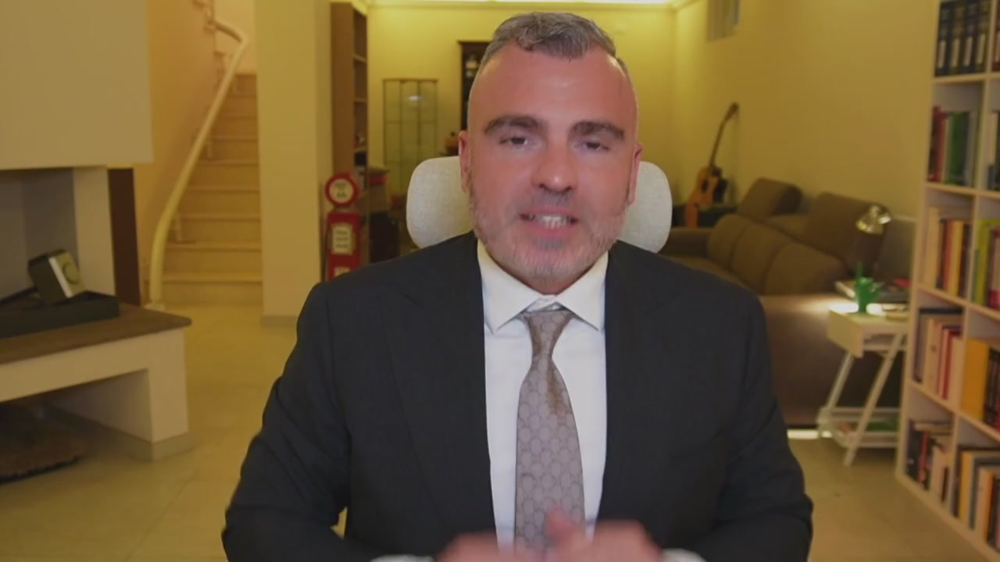
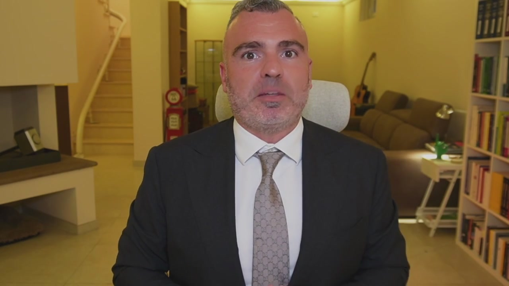

# Diventa libero di fare impresa, ottieni ricchezza e goditi la vita senza preoccupazioni fiscali

> Documento generato automaticamente: trascrizione e screenshot sincronizzati del video-corso.

## [00:00:00] Schermata 0 _(start)_

> Siamo arrivati a conclusione di questo corso ed è mia premura innanzitutto ringraziarti per essere arrivato fino qui. Come avrai capito, le tematiche sono molte complesse, basti pensare a quelle inerenti al passaggio generazionale a protezione del patrimonio, dove il confronto con l'avvocato e il notario diventa imprescindibile. Ma quello che io vi voglio ricordare è che il mio team è quel team che si occupa di sviluppare la pianificazione 3.0 Anche senza cambiare commercialista, in ausilio dei professionisti che lavorano con te. Perché la pianificazione fiscale è un qualcosa di più grande dagli adempimenti tributari e contabili, è un qualcosa di diverso, è un qualcosa di parallelo, di complementare ma assolutamente necessario per poter sviluppare la tua azienda. Hai visto nel caso 1 come siamo arrivati al 50% di risparmio

## [00:01:00] Schermata 1 _(periodic)_

> fiscale, al 30% nel caso 2, a importanti risparmi di protezione anche patrimoniale nel caso 3. E questi obiettivi puoi perseguirli anche tu, perché non sono a pannaggio delle grandi aziende, sono a disposizione di tutti e ti ho fatto vedere anche in termini pratici come si raggiungono. Quindi quello che devi fare adesso è entrare in contatto con il mio team, avere una valutazione gratuita del tuo caso per capire se fare o meno questa scelta e iniziare veramente carta alla mano a risparmiare sulle imposte e a proteggere i frutti del tuo sacrificio. Noi ci vediamo prossimamente nei miei contenuti e grazie ancora per essere stato qua con me.
