# Claude Fable 5: Guida COMPLETA (Riccardo Belli Contarini)

> Documento generato automaticamente: trascrizione e screenshot sincronizzati del video-corso.

## [00:00:00] Schermata 0 _(start)_

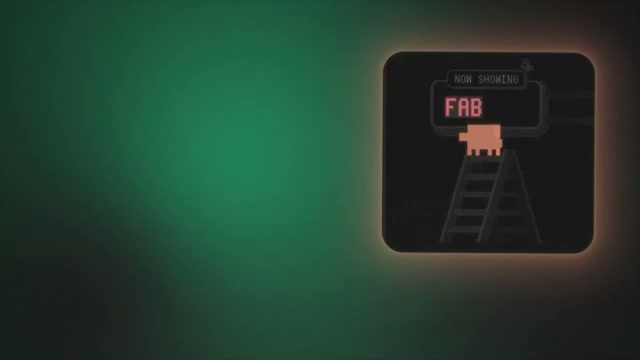

> Cloud Fable 5 è il modello più intelligente mai uscito, ma la maggior parte delle persone

## [00:00:04] Schermata 1 _(scene)_

> lo sta utilizzando in un modo che lì si ritorcerà contro. Si fanno costruire l'80% del loro progetto da Fable 5 adesso, finché ce l'hanno. Poi, fra qualche giorno, Fable 5 non ci sarà

## [00:00:12] Schermata 2 _(scene)_

> più o costerà troppo. E l'ultimo 20% del progetto, che di solito è la parte più difficile, lo faranno fare a un altro modello, come ad esempio Opus. E ti posso assicurare che chi

## [00:00:22] Schermata 3 _(scene)_

> ragiona così farà un bagno di sangue. In questo video voglio farti vedere il modo

## [00:00:28] Schermata 4 _(scene)_

> giusto di usare Fable 5, un metodo che sfrutta davvero la sua intelligenza, che si basa su una guida che ha fatto un ingegnere di Antropic, un ingegnere che lavora proprio allo sviluppo di Cloud Code. E questo metodo l'ho testato anche io personalmente. E non parleremo solamente di teoria, ti dirò come applicare tutto nel pratico e andremo a vedere un mio caso d'uso, ossia rifare tutto quanto il mio sito, che è estremamente complesso

## [00:00:48] Schermata 5 _(scene)_

> perché ha un sacco di pagine all'interno. Se è la prima volta che vedi questi video,

## [00:00:53] Schermata 6 _(scene)_

> sono un ingegnere informatico e gestisco Martes AI, un'azienda attraverso la quale aiutiamo le imprese a scalare, implementando l'intelligenza artificiale all'interno del loro processo. A partire dalla formazione del loro team su strumenti pratici come Cloud

## [00:01:06] Schermata 7 _(scene)_

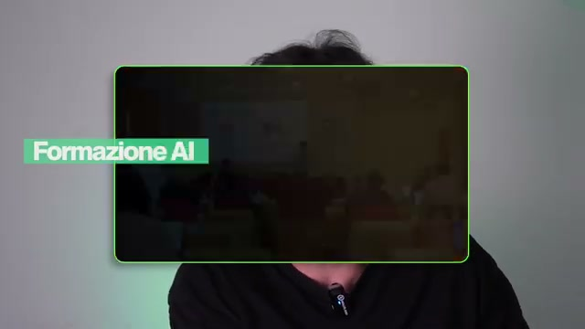

> Code, Cloud Cowork o la costruzione di Second Brain, poi andiamo ad analizzare i loro processi

## [00:01:10] Schermata 8 _(scene)_

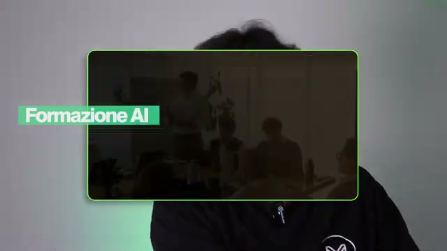

> per capire dove ha senso integrare le AI all'interno della loro realtà, fino a poi andare a sviluppare queste soluzioni che troviamo insieme. Abbiamo lavorato ormai con più di 65 aziende,

## [00:01:19] Schermata 9 _(scene)_

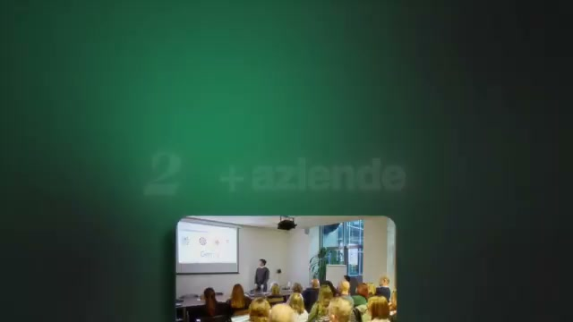

> abbiamo fatto in produzione più di 75 soluzioni AI e formato dal vivo più di 500 persone. E quello che ti sto dicendo ora su Fable 5 si basa sulla nostra esperienza sia personale

## [00:01:25] Schermata 10 _(scene)_

> ma anche sui nostri clienti, dopo aver testato per settimane questo nuovo modello. Detto ciò, dovete passare subito al video. Ecco qui la guida completa su come utilizzare

## [00:01:36] Schermata 11 _(scene)_

> Cloud Fable 5. Abbiamo visto ormai diversi esempi online, che questo è il modello più potente mai reso pubblico e la cosa più importante è che fra poco non sarà più presente gratuitamente all'interno della tua iscrizione a Antropic, ma diventerà Pay Per Use con l'API. Uguale, costerà un sacco. Cosa è successo con Fable 5? Piccolo recap, esce il 9 giugno, il 12 giugno lo sappiamo quello che è successo con il governo americano, quindi Fable 5 viene sospeso, l'1 luglio rilasciano di nuovo Fable 5, il 7 luglio dovete uscire dall'abbonamento, cioè Pay Per Use con l'API, dopo le proteste Antropic propaga l'accesso incluso di 5 giorni, 12 luglio, cioè fra 2 giorni, probabilmente questo video uscirà già il 12 luglio, però Fable passerà Usage Credits, cioè paghiamo 10 dollari per milione di token in input e 50 per milione di token in output. Il prezzo più alto mai pubblicato da Antropic, lo reintegrerà quando avrà capacità. E quindi il concetto

## [00:02:31] Schermata 12 _(scene)_

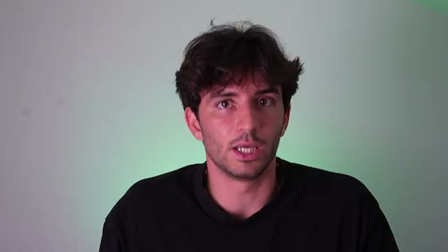

> è quello di utilizzare questo modello con parsimonia, perché fra poco ce lo staccano e inizierà a diventare costosissimo. Non lo dico solamente io, lo dicono persone anche molto più esperte di me, come ad esempio Salvatore Sanfilippo, uno dei migliori informatici

## [00:02:42] Schermata 13 _(scene)_

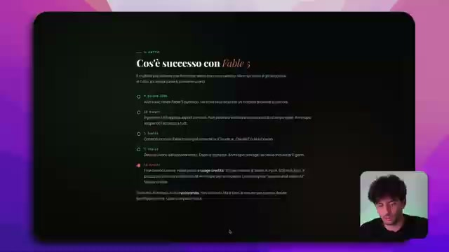

**Testo a schermo (OCR):** Cosè successo con / 1/0 >

> della storia italiana ed europea. Bene, l'errore dell'80-20, questo è il problema che vedo più spesso quando parlo con le persone che hanno utilizzato Fable 5, cioè che cosa fanno? Costruiscono con Fable finché ce l'hanno, ma costruiranno fino all'80% con Fable, quando Fable 5 tornerà a Pay Per Use, cioè pagare con l'API, la gente ovviamente non vuole pagare così tanto e quindi finirà al 20% con un altro modello, uguale un casino. Cioè tu gli consegni un codice mezzo costruito, l'80% di decisioni fatte con un ragionamento diverso, fatto da un modello molto più potente quale Fable 5, quindi qual è il problema?

## [00:03:21] Schermata 14 _(scene)_

> Che noi andiamo a fare l'80% della nostra applicazione, magari anche le cose un po' più semplici, non la UI e quant'altro, con Fable 5, quel 20% rimanente andremo ad utilizzare un altro modello, perché Fable 5 ce lo staccano, nel 90% dei casi quel 20% rimanente è la parte più difficile della nostra applicazione e quindi si va a sozzare essenzialmente tutto il codice che ha prodotto Fable, proprio perché è un modello di gran lunga più potente rispetto a un Opus 4.8. Risultato? Probabilmente tappandoci il naso dovremo poi pagare Pay Per Use a Fable 5, quindi migliaia e migliaia di euro in bollette API. Ma credo che ci sia una strada più intelligente

## [00:03:58] Schermata 15 _(scene)_

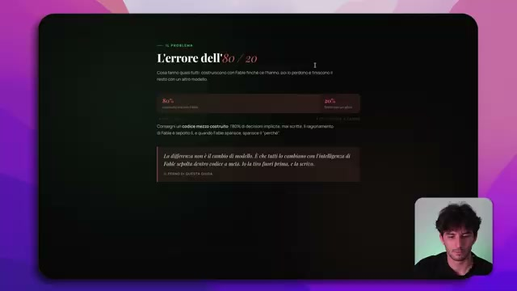

> che ci ha mostrato un ingegnere che lavora a Antropic. Ora, c'è un cambio di paradigma, il limite non è più il modello, ma sei tu. Con i modelli deboli sbagliava il modello, con Fable è talmente intelligente che il collo di bottiglia siamo diventati noi, cioè quanto bene riusciamo a dirgli che cosa vogliamo. Non è una mia teoria, questa viene da Tariq, un ingegnere di Antropic, le sue parole tradotte sono che Fable è il primo modello in cui mi trovo che la qualità del lavoro è limitata dalla mia capacità di chiarire i suoi unknowns, dove i suoi unknowns sono i buchi tra quello che ho in testa e quello che scriviamo, cioè noi in testa sappiamo magari quello che vogliamo, ma quanto bene glielo comunichiamo a Claude. Quindi istruire Claude è un equilibrio delicato, se sei troppo specifico seguirà le tue istruzioni anche quando cambiare strada sarebbe più giusto. Se sei troppo vago farà scelte e assunzioni basate sulle best practice del settore, o in base a come è stato allenato il modello, che magari non c'entrano nulla con il tuo caso e quindi capite che c'è questo equilibrio che va raggiunto. Ora, prendendo dalla guida di Tariq, che è questo ingegnere di Antropic,

## [00:04:58] Schermata 16 _(periodic)_

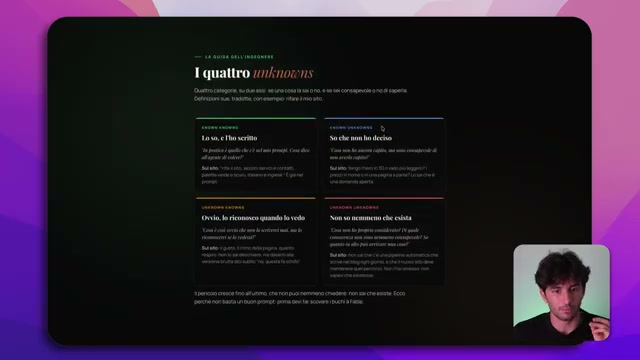

**Testo a schermo (OCR):** I quattro 170/1107725

## [00:05:02] Schermata 17 _(scene)_

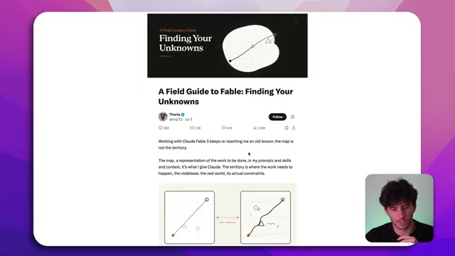

**Testo a schermo (OCR):** Finding Your Unknowns Mara

> se la volete andare a leggere basta che cercate Tariq, che è questo ingegnere che lavora lo sviluppo europeo di Cloud Code, a Field Guide to Fable. E qua c'è tutta la guida che mi sono andato a leggere e che ho riassunto essenzialmente nel concetto di questo video. E parla di questi quattro concetti qua che adesso andremo a vedere meglio. I quattro unknowns, lui li chiama,

## [00:05:21] Schermata 18 _(scene)_

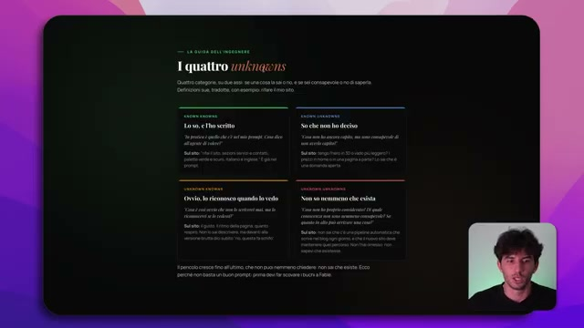

**Testo a schermo (OCR):** I quattro 17:/720725

> cioè sono quattro categorie che sono known-knowns, known-unknowns, unknown-knowns e unknown-unknowns. E no, non è uno sciollilingua, bensì, known-known. Lo so e l'ho scritto, cioè quello che c'è il mio prompt. Io so che cosa devo realizzare e l'ho scritto. Perfetto. Known-unknowns, cioè c'è un qualcosa che so che non ho deciso, cioè che ne so, devo fare, devo modificare la hero section del mio sito, non so bene come la faccio, non glielo dico a Cloud, ma sono consapevole che non glielo sto dicendo. Unknown-unknowns sono quelle cose che sono talmente tante ovvie che neanche le scrivo a Cloud. Magari non sono così ovvie, ma io le ho per scontato. Quindi sono quelle cose che dico, ah vabbè Cloud, ma questo era ovvio, no? Cioè, questo lo riconosco quando lo vedo. Cloud, grazie, questo era ovvio. Che vada ad omettere perché per me è un concetto ovvio, oppure per motivo X abbiamo messo. Quindi è così ovvio che magari non lo scriverei mai in qualcosa di questo tipo. E poi ci sono gli unknown-unknowns, cioè sono qualcosa che nemmeno io so che esiste. Delle cose che io non ho proprio

## [00:06:21] Schermata 19 _(periodic)_

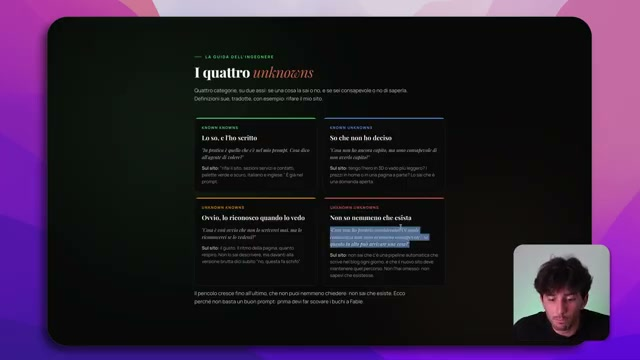

**Testo a schermo (OCR):** 1 quattro 112/7107775

> considerato e non sono minimamente consapevole. Ad esempio io andrò a rifare il mio sito in questo video. Il mio sito non è per niente banale, se andate a vedere ci sono centinaia di pagine, quindi non è banale rifare un sito così complesso da zero. E ad esempio c'è una pipeline automatica che scrive, che mi va a prendere i miei video, me li ottimizza per la SEO e me li va a mettere sul sito. Attenzione perché questa è una cosa che magari se gli dico di andare a modificare tutto, magari mi va a eliminare questa automazione, quindi sono delle cose di cui magari non ho proprio considerato all'inizio. Il pericolo cresce fino all'ultimo, quindi andiamo con pericolo minore, perché l'ho scritto, fino a pericolo maggiore. Ecco perché non basta un prompt, dobbiamo far scovare, in realtà solo questi tre, perché qua l'abbiamo scritto, queste cose a Cloud Fable 5. Quindi il modo in cui io utilizzo Fable 5 e come vi consiglio di fare, perché fra poco Fable 5 ritorna a utilizzo di API e una volta che ci siamo abituati a quella qualità là, sarà difficile tornare indietro, è sfruttare la metodologia di Tariq, l'ingegnere che lavora ad Anthropic, quindi sfruttarlo per scovare i buchi, quindi per gli

## [00:07:21] Schermata 20 _(periodic)_

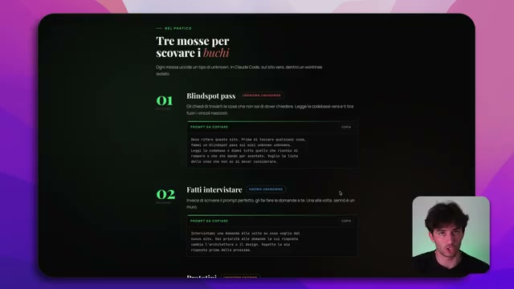

**Testo a schermo (OCR):** Tre mosse per scovare i Michi Qu tintprt pis

> unknown unknowns, cioè quelle cose di cui io neanche sono consapevole. Blind spot pass, lo chiama Tariq, se vedete qua ne parla approfonditamente nella sua guida, se volete andarvi a dare una letta.

## [00:07:32] Schermata 21 _(scene)_

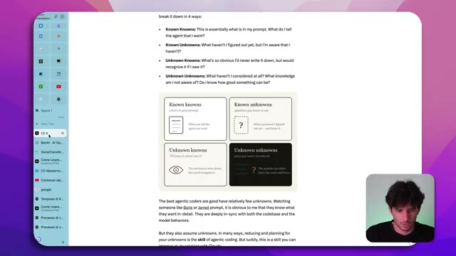

> Vi vogliamo chiedere di trovare quelle cose che non saprei neanche dirti io stesso, quindi leggi

## [00:07:40] Schermata 22 _(scene)_

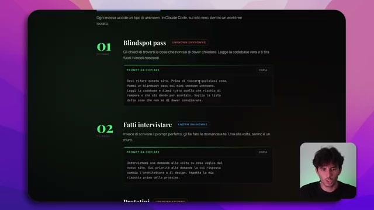

> la codebase e tirami fuori i vincoli nascosti, questo sarà un prompt che noi ci copriremo e utilizzerò per rifare essenzialmente il mio sito. Devo rifare questo sito, prima di toccare qualsiasi cosa fammi un blind spot pass sui miei unknown unknowns. Leggi la codebase e dimmi tutto ciò che rischio di rompere o che sto dando per scontato. Due, fatti intervistare, cioè per i known unknowns, cioè le cose che so che non gli ho detto, tipo come voglio rifare la hero section, non lo so, vabbè non glielo dico. Per questa cosa invece di scrivere il prompt perfetto e scrivere ogni cosa, gli facciamo fare le domande, cioè intervistami una domanda alla volta su cosa voglio dal nuovo sito. E no, questo è diverso dalla play mode e da super powers, vediamo dopo. E per gli unknown knowns, cioè quelle cose che io ti do a scontato, che magari riconosco solamente vedendolo, cioè quella cosa che mi fa dire cavolo Claude questo era scontato no? Perché non l'hai capito? Prima di toccare il sito vero fammi un file html con quattro

## [00:08:40] Schermata 23 _(periodic)_

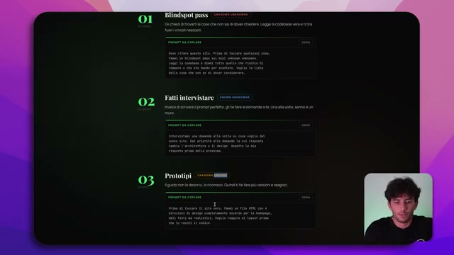

> direzioni di design completamente diverse per la home page. Dati finti ma realistici. Voglio prima vedere il layout prima che vai a toccare il mio codice. Non è un piano fatto con play mode, con super powers. Per chi non lo conosce, super powers è una skill per farci intervistare da Claude per fare il piano perfetto. La play mode e super powers fanno un ottimo piano, ma un piano che parte da quello che hai chiesto. Ti dice come costruire non cosa ti sei dimenticato. Quindi in questo metodo noi vogliamo trovare gli unknowns, cioè risponde a che cosa non ti ho detto che sia un qualcosa che ancora non ho deciso o che pure era talmente scontato che non te l'ho detto oppure non te l'ho detto perché neanche io lo so. Quindi parte da quello che sai di non sapere, mette in discussione la richiesta, ti dà i buchi della mappa prima di partire. Quindi l'obiettivo è far pensare a Fable. In realtà Fable è anche un termine errato, non vogliamo fargli pensare. Ma è come se Fable fosse un ingegnere informatico senior che dice a un ingegnere informatico junior, Opus, ecco esattamente cosa devi fare, a cosa devi stare attento, le cose

## [00:09:40] Schermata 24 _(periodic)_

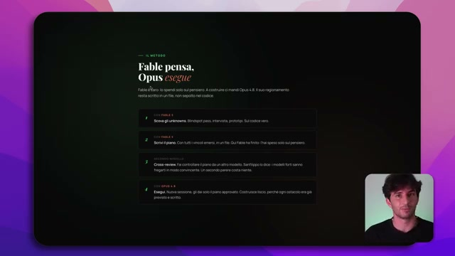

**Testo a schermo (OCR):** Fable pensa, gue

> a cui non abbiamo riflettuto e puoi utilizzare un modello di frontiera inclusa nella nostra subscription come Opus. Quindi con Fable scoviamo questi unknowns che vi assicuro che non è affatto un qualcosa di facile, ci scriviamo un piano e poi volendo possiamo fare una cross review, questa è una cosa che ad esempio diceva San Filippo in un suo ultimo video, cioè farci controllare il piano da un altro modello oppure far eseguire subito dopo con Opus, solamente quando abbiamo approvato questo piano e scovato questi unknowns. Bene, andiamo a rifare il mio sito. Chi

## [00:10:17] Schermata 25 _(scene)_

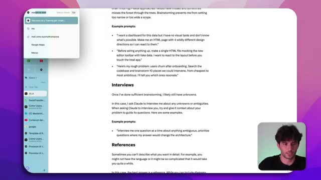

> non lo sapesse questo è il mio sito che è pieno pieno pieno di pagine, c'è questa pagina qua dove io ci entro, ci sono diverse foto che adesso non si caricano perché la mia wifi è pessima, però ci sono dei loghi animati. Tornando indietro io ho queste altre landing page che sono per i nostri prodotti con dei video, un calcolatore dinamico, insomma è veramente pieno di roba questo sito,

## [00:10:38] Schermata 26 _(scene)_

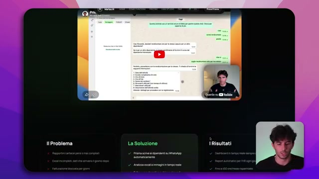

**Testo a schermo (OCR):** Probioma La soluzione Risultati

> ci sono i casi studio che è tutta una pagina a parte, dentro ognuno di questi c'è il video

## [00:10:50] Schermata 27 _(scene)_

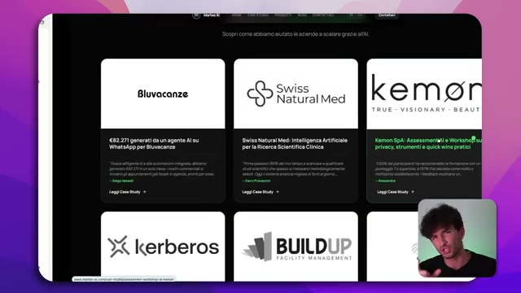

> del caso studio, insomma questo sito è pieno pieno di roba ed è pesantissimo. Bene, andiamo a

## [00:10:54] Schermata 28 _(scene)_

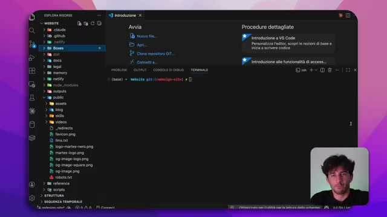

**Testo a schermo (OCR):** Aria Brcen Procedure dettagliate UERdETZIa: DET reina zioni i accesi. pain

> modificare tutto quanto il mio sito, nello specifico devo ristrutturare il mio sito, questo è tutto

## [00:10:59] Schermata 29 _(scene)_

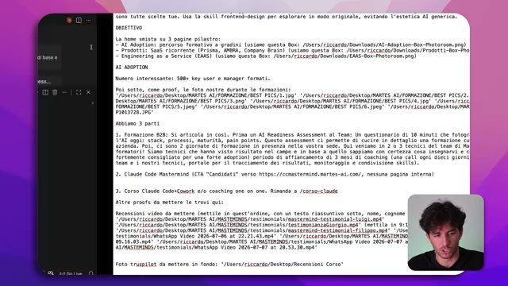

> quanto il codice del mio sito, che vedete è un sacco di roba e essenzialmente io qua ho fatto un prompt, un po' mi sono fatto aiutare da Claude, un po' l'ho scritto a mano perché voglio modificare essenzialmente il mio sito perché devo aggiungere un po' dei nuovi servizi, cioè abbiamo aggiornato tutta la nostra parte di formazione, i nostri prodotti, non è più sviluppo custom ma si chiama engineering as a service, insomma un sacco di roba. Ora, io prima di passargli tutto questo prompt,

## [00:11:22] Schermata 30 _(scene)_

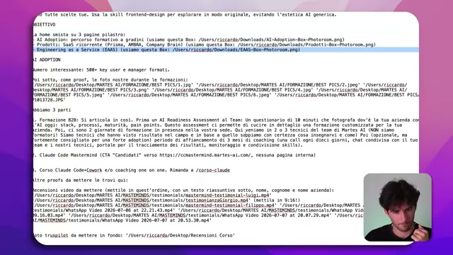

**Testo a schermo (OCR):** I er

> devo ristrutturare il sito di Martes bla bla bla, vado a fare un blind spot pass, cioè io mi vado a

## [00:11:27] Schermata 31 _(scene)_

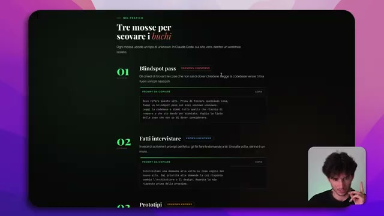

**Testo a schermo (OCR):** "Tre mosse per scovare i /o/i

> copiare questo prompt per andare a vedere, prima di toccare qualsiasi cosa, dimmi tutto ciò che rischio di rompere. Quindi prima di fare questo, allora io ho aperto qua il terminale perché mi piace usarlo da qua quando vado a fare, essenzialmente l'ho detto in miei parecchi video, però io utilizzo cloud da terminale se devo andare a fare lavoro di codice, mentre cloud qui dall'estensione se devo fare lavoro tipo di scrittura di copy, posta, email e cose di questo tipo. Detto ciò, allora io sono qua per come prima cosa, anzi questo me lo tiro su, questo lo droppo così, faccio mod, come prima cosa, slash model e vado a mettere opus e vado a mettere fable. Ecco qua, abbiamo fable, io qua faccio slash fworth, ecco qua, fforth andrò a mettere max, proprio perché quello che voglio fare specialmente per questa parte qua degli unknowns, cioè cose che se non scopro ora, probabilmente

## [00:12:27] Schermata 32 _(periodic)_

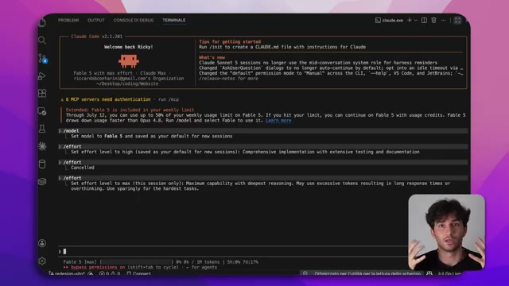

> vanno a rompere tutto il sito. Ora, questo è un altro tip, nel frattempo qua vado a pulire, quindi slash clear, una cosa che vi consiglio sempre di fare è che se dovete andare a fare una modifica, prima lavorate il locale e vi consiglio di fare questa cosa qua, cioè cloud io vorrei andare a modificare il mio sito, vorrei però lavorare localmente, quindi per prima cosa andiamo a lavorare su un worktree separato. Essenzialmente quello che andiamo a fare è che invece di modificare il sito, creiamo una copia parallela, lavoriamo su quella senza rompere il sito, lavoriamo localmente su quella e appena quella è pronta, ritorniamo la versione quella da mandare qua in produzione. Nel frattempo che qua lui mi crea un worktree, quello che posso fare è creare una nuova sessione e nel frattempo mettere slash usage, così nel frattempo andiamo a vedere piano piano quanto stiamo andando a consumare. Quindi salviamoci queste cose, fable stiamo a 0, utilizzo weekly 17% e la sessione di CQR 29%. Pronti? Bene, si parte. Allora, ritiriamo

## [00:13:27] Schermata 33 _(periodic)_

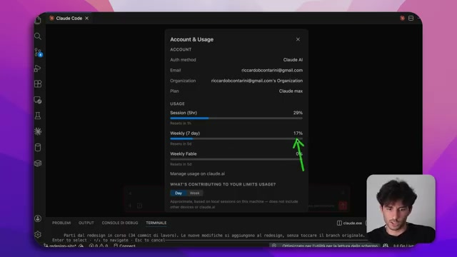

**Testo a schermo (OCR):** account spe

> sul terminale. Da quelle branch partire per il worktree, già lo stavo ridisegnando, quindi essenzialmente io il mio sito principale già stavo ridisegnando con opus, poi adesso è uscito per fable, voglio ripartire da una copia del sito da quello originale, quindi non voglio fare una copia della copia dal main. Nel frattempo il Claude qua mi risponde, vi volevo far vedere visivamente

## [00:13:52] Schermata 34 _(scene)_

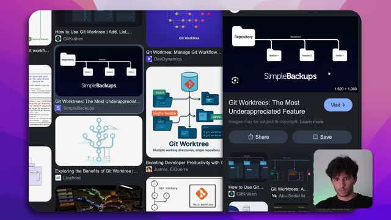

**Testo a schermo (OCR):** 5 SimpleBackups * SreBadupe si È Git Worktrees: The Most (>) Underappreciatedi Feature di Shore DI Sn

> questa cosa di worktrees perché è fondamentale, cioè se avete il vostro progetto qui, quando create un worktree, si crea di solito un worktree per ogni nuova feature, fidatevi, figuriamoci se voglio fare un redesign del mio sito. E quello che mi ha chiesto è, guarda, a partire dal tuo progetto

## [00:14:07] Schermata 35 _(scene)_

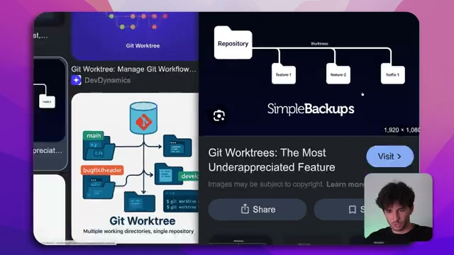

**Testo a schermo (OCR):** Gil Worktree: Manage Git Workflow pa SimpleBackups 1.920 100 Git Worktrees: The Most | Underappreciated Feature Ci Share

> vogliamo creare un worktree qua, cioè quindi vogliamo muoverci così, o siccome già avevo creato

## [00:14:15] Schermata 36 _(scene)_

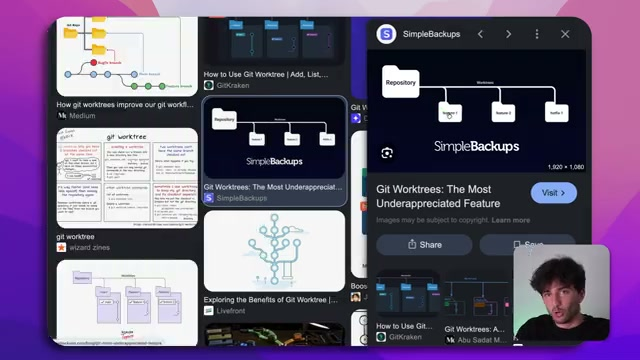

**Testo a schermo (OCR):** e SimpleBackups Gone e ini Git Worktrees: The Most Pi Underappreciated Feature di Stare

> un worktree vogliamo ribiforcare qua. Gli ho detto no, no, ribiforca dal progetto principale, questo è

## [00:14:20] Schermata 37 _(scene)_

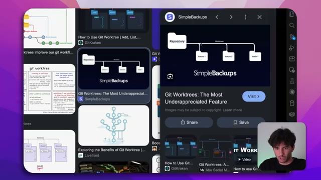

**Testo a schermo (OCR):** ® SimpleBackups Srna recava Mi onsse meri e} fwd

> quello che gli ho detto. Ok, worktree pronto, alla grande. Dimmi pure cosa vuoi modificare del sito. Tornando sulla presentazione mi vado a prendere il blind spot pass, quindi io lo passo qua, questo prompt lo trovate nel secondo link qui sotto nei commenti, e io lo vado a passare. Quindi, devo rifare questo sito prima di toccare qualsiasi cosa, fammi un blind spot pass sui miei unknown unknowns. Già, vi dico che utilizzerò max solamente per il blind spot pass, dove max intendo l'effort, l'effort di quanto sta pensando Fable, poi utilizzerò o hi o xhi per questo e questo. E ecco qua, ottimo approccio, lancio un blind spot pass Cinque agenti di esplorazione in parallelo. Si fa un check sul rapporto con Redesign già in corso. E poi sintetizza la lista dei rischi. Non toccherà nulla. Quindi ecco qua che ci appare la nostra lista degli agenti. Eccoli qua. Quindi noi abbiamo uno che mi sta esplorando questa parte qua. Vedete? Questo mi sta esplorando questa parte qua. Questo questa parte qua.

## [00:15:20] Schermata 38 _(periodic)_

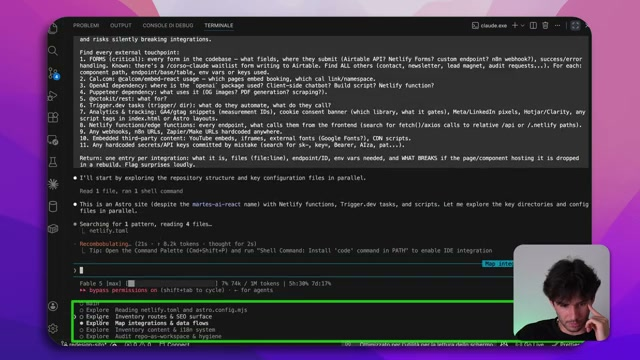

**Testo a schermo (OCR):** i nanna Lotsonean n ne mare i cen

> E ce li possiamo aprire. Poi torno sul main principale. Quindi vedete possiamo andare a vedere ogni agente che cosa diavolo sta combinando. E vediamo che sta iniziando a spendere un bel po' di token. Ovviamente perché tutti questi sott'agenti sono sott'agenti Fable. Quindi io quello che vi consiglio di fare è sfruttare questi ultimi giorni dove Fable è ancora all'interno della nostra subscription di Antropic. E fare questa cosa per ogni progetto che volete fare. Quindi avevate 10 progetti in mente? Bene, fatelo per ogni 10 i progetti. E poi il resto potete continuare con Opus quando Fable ve lo levano. Ecco qua che Fable mi ha risposto. Urgente, a prescindere dal redesign, c'è un tokener table reale commentato su GitHub. Cavolo. L'ho rigenerato subito. Meno male che me l'ha detto. Poi ci sono due file che esistono solamente sul disco. Ok, questo le dico di fixarmelo. Il tuo stesso workflow può pubblicare la partita IVA dei clienti perché il gitignore non copre questo. Ok, come prima cosa le dico. Ok, punto 1. Già rigenerato il token.

## [00:16:20] Schermata 39 _(periodic)_

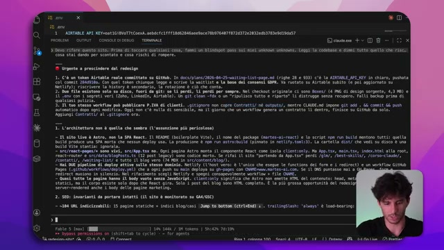

**Testo a schermo (OCR):** te chio ppi osa Done + DA

> Controlla che sia tutto ok. Punto 2 e 3. Fixa tu per me. Grazie. Anzi, siccome ha già fatto la parte difficile, adesso levo l'effort e ritorno su... Andiamo con XAI. Qua rincollo e andiamo avanti. E gli dico. L'architettura non è quella che sembra. Il sito live è Astro, non la SPA React. Hai due pipeline deploy attive sullo stesso dominio. Siamo invarianti, forno integrazioni. E qua mi ha trovato tutti i blind spot. Trappole da evitare. Ottimo, tante di queste cose non ci avrei minimamente pensato. Intanto, gli dico questo. Ora lo step numero 2 è quello di farci intervistare. Io ho già il prompt pronto, quindi gli passerò tutto questo prompt e lo varierà un pochettino questo prompt.

## [00:17:09] Schermata 40 _(scene)_

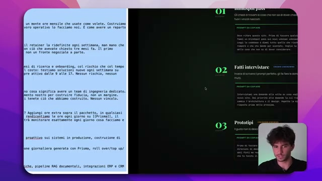

**Testo a schermo (OCR):** dd 03 tm

> Cioè gli dirò, guarda, questo è tutto quello che voglio fare. Intervistami una cosa alla volta, in base a quello che magari... Per trovare i known unknowns. Quindi modifico un attimo questo prompt. Dando priorità al domande la cui risposta cambia l'architettura o il design. Quindi vabbè, a questo punto, qua mi prendo questa nota di testo.

## [00:17:32] Schermata 41 _(scene)_

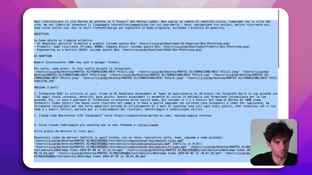

> E mi incollo qua il prompt. E gli dico. Ti allego qui sotto il prompt per ristrutturare il mio sito. Leggilo attentamente. E poi, se ci sono delle cose che non ti sono chiare, nello specifico io voglio scovare i known unknowns.

## [00:17:49] Schermata 42 _(scene)_

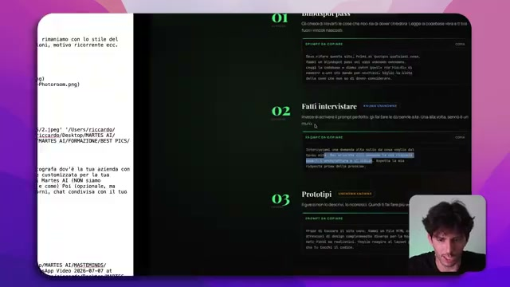

**Testo a schermo (OCR):** attintervistre oz 03. too

> Allora intervistami una domanda alla volta su cosa voglio dal nuovo sito. Dai priorità alle domande la cui risposta cambia l'architettura o il design. Aspetta la mia risposta prima della prossima. Ok. Qua separo un attimino ed ecco qua. Quindi qua c'è la roba per trovare i known unknowns e qua c'è tutto il prompt che ho fatto io. Molto bene.

## [00:18:10] Schermata 43 _(scene)_

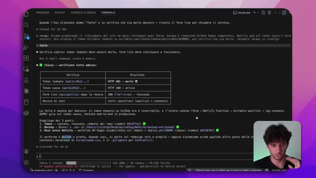

**Testo a schermo (OCR):** == Sonne 4 DE = Ta F

> Qui ha fatto. Quindi mi prendo il prompt che c'eravamo preparati e lo allego qui in chat. Allora qui ha fatto e invece di mandare prima questo, sapete che ci metto anche questo per trovare gli unknown unknowns.

## [00:18:18] Schermata 44 _(scene)_

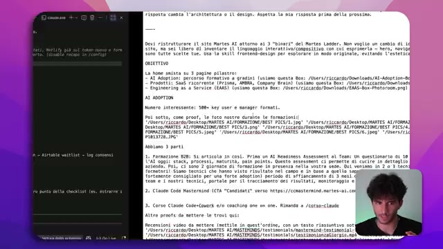

> Cioè che prima di toccare il sito vero mi deve fare un file html. Quindi, prima ci facciamo intervistare. Quindi si va a leggere il prompt che gli ho passato. Ci intervista. E poi, una volta che finisce di intervistarci, si va a prendere questa parte qua. Quindi mi va a fare un file html con le direzioni. Quindi, sapete che facciamo?

## [00:18:42] Schermata 45 _(scene)_

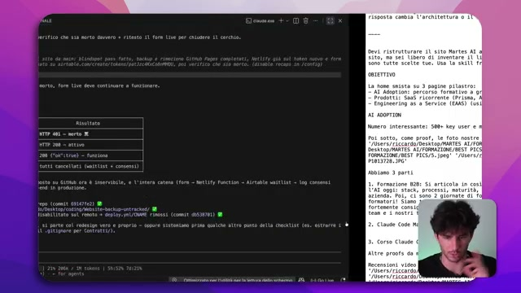

> Facciamo. Step 1. Ti allego qui sotto il prompt per ristrutturare il sito. Step 2. Leggi il prompt. Quindi step 3. Eccolo qua. Quando hai finito di intervistarmi, prima di toccare il sito vero fammi un file html con 4 direzioni di design completamente diverse. Non per la home page, ma in questo caso è per il mio sito. Dati finti ma realistici. Voglio reagire al layout prima che tu tocchi il codice. Alla grande. Ci prendiamo questo prompt e ce lo passiamo qua.

## [00:19:15] Schermata 46 _(scene)_

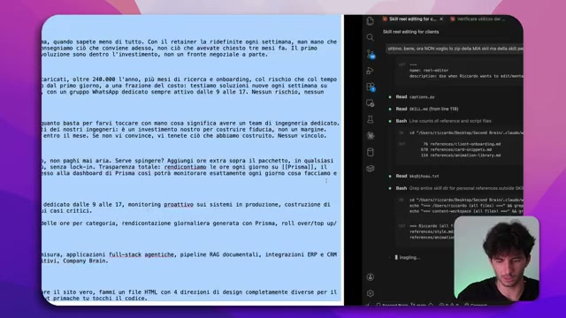

> Molto bene. Quindi, ricapitolando. Abbiamo trovato prima gli unknown unknowns. Cioè quelle cose che io non avrei scopato. Abbiamo sfruttato Fable per risolvere quelle tre criticità. Non solo abbiamo risolto quelle tre criticità, ma adesso lui sa quella a cui deve stare attento. La parte della SEO. Cosa deve fare. I form e integrazioni. Devi stare attento a determinate cose. E adesso sappiamo quella cosa. Poi quello che vogliamo fare è che ci intervista per trovare i known unknowns. Cioè quelle cose che io veramente scontato che non glielo ho chiesto. In base a questo mega prompt per modificare il sito. Step numero 3. Quando hai finito di intervistarmi, proponimi delle direzioni. In questo modo, quando ho finito di intervistarmi, sappiamo la direzione da prendere. A quel punto abbiamo trovato ogni possibile falla. E possiamo proseguire con Opus. Questo è il concetto. Ed ecco le prime interviste. Quindi, come gestiamo i pilastri rispetto alle pagine esistenti che coprono gli stessi temi. Cioè, quindi url nuovi, andiamo a modificare gli url esistenti.

## [00:20:15] Schermata 47 _(periodic)_

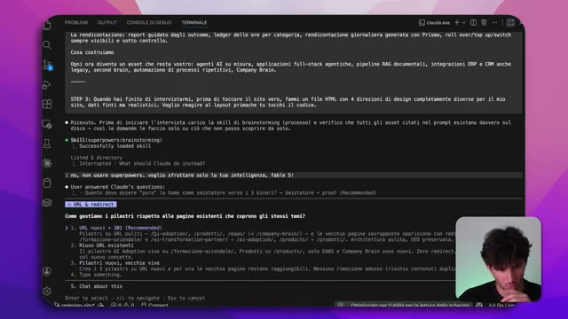

**Testo a schermo (OCR):** Li pun peri pa icon er a gr tri cai gina pu se in ri tti ie i tc mi lO. did di im die 17

> Lui consiglia url nuovi. Quindi direi con url nuovi. E quindi, stando appunto su un worktree, possiamo lavorare tranquillamente, modificare, eliminare i file. Ok, che relazione c'è tra i tre binari? Allora, lui parla dei tre binari. Perché noi essenzialmente abbiamo tre binari nel nostro sito. Abbiamo AI adoption, prodotti e engineering as a service. Che sarebbe la nostra parte di sviluppo custom. Quindi, che relazione c'è tra i tre binari? Scala di maturità, cioè un cliente tipico parte dalla formazione, poi adotta i prodotti. Tre binari paralleli. Ok, io metterei paralleli perché magari uno può entrare e scegliere il prodotto. Può scegliere lo sviluppo custom, la parte di adoption. Sulla parte di engineering as a service, EAS. L'ho chiamata così, tipo SAS, EAS, vabbè. Mostriamo i pacchetti di ore. Con o senza prezzi. Io metterei pacchetti senza prezzi. Cioè essenzialmente, giusto per darvi contesto, il pacchetto di engineering as a service ti compri ore di ingegneria.

## [00:21:15] Schermata 48 _(periodic)_

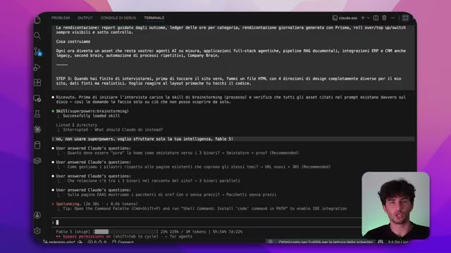

> Questo è un po' il concetto. Il questionario è ai readiness assessment. Noi facciamo l'assessment prima delle formazioni. Esiste già come strumento. Si fa dopo la call. Però questo potrebbe essere uno spunto carino. Hm, bravo Fable. Come strutturiamo la navbar, cioè la barra sopra. Navbar sui tre binari. Quindi AI adoption, prodotti, com drop down, con tutti i prodotti, bello. EAS, bellissimo, mi piace. Le nuove pagine, pilastri, EAS, company brain, escono in che lingua? Solo l'italiano. Già noto una differenza rispetto alle domande che mi fa Superpowers, che sono molto più intelligente e più strutturate, diciamo. Ok, poi questa è un'altra chicca. Anche se è Fable 5, io voglio utilizzare sempre front-end design. Che è una delle skill migliori per generare front-end. Che sia una presentazione o una qualsiasi cosa. Quindi adesso si andrà ad analizzare questa skill. Allora, ecco qua cos'è successo. Siamo arrivati all'ultima fase, dopo che mi ha intervistato. Mi ha fatto in HTML, mi ha proposto diverse direzioni. E adesso andiamo a vedere tutte.

## [00:22:15] Schermata 49 _(periodic)_

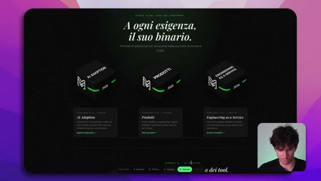

**Testo a schermo (OCR):** A ogni esigenza, il suo binario.

> A, scambi. Molto figa questa. Con queste tre linee che si illuminano. Molto carina. B, trittico. Carino anche questo. Molto carino. Poi c'è questa parte giù. C'è la parte C. No, non mi piace per niente. Vetrina. Che secondo me è il più pulito di tutti. Quindi proprio bello. Mi piace. Con le foto qua carine. Molto carine. Quindi poi, che cosa ho fatto? Gli ho detto che la D mi piace molto. Mi raccomando la I lo lasciamola così, bla bla bla. Parti. Ovviamente per partire ho sbucciato il modello. Cioè sono andato con Opus. Quindi quello che ho fatto è che abbiamo fatto tutta la parte iniziale con Fable. E poi abbiamo continuato con Opus. L'ho lanciato e ha fatto tutto qua. E il risultato è questa roba qui.

## [00:23:09] Schermata 50 _(scene)_

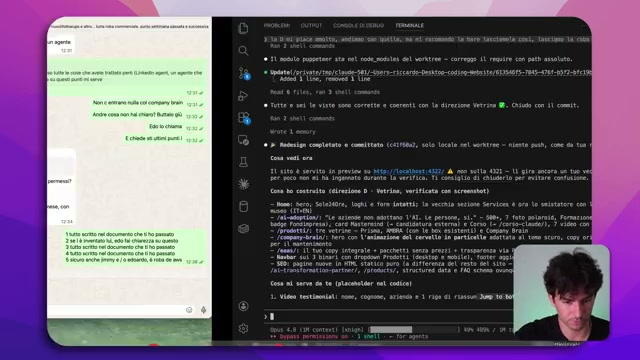

> Quindi questo è il sito. Con tre binari. Una scelta con le box che gli avevamo chiesto. Questi numeri qua. Alla grande. E andiamo a vedere uno a uno. Adoption. Con questa scatola qui. Sempre molto carina. Le aziende non adottano le I. Le persone sì. Molto figo. Con le foto qui. Con questo stile. Mi piace. E qui nulla di che. Cioè quello che avevamo detto. Nel senso formazione B2B. Cloud Code Mastermind. Corso di Cloud. Bla bla bla. Non fidarti di noi. Fidati di loro. Con tutte quante le recensioni. Ok. Domande frequenti ha messo. Qua ha messo tutte quante le recensioni di Thrustpilot. Molto carine.

## [00:23:48] Schermata 51 _(scene)_

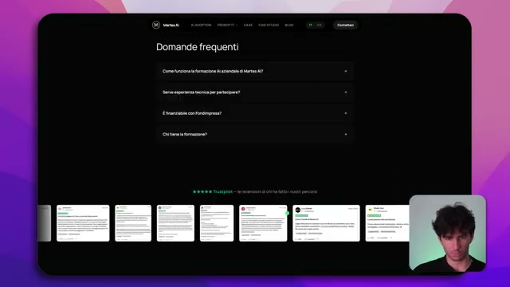

**Testo a schermo (OCR):** Domande frequenti i i EC]

> Ok. Se tornassi indietro. Funziona anche il polsante. Andiamo sui prodotti. Prisma. Ambra. Company Brain. Ok. Andiamo sul Company Brain che era la nuova pagina. Ottimo. Ha messo l'animazione che gli dicevo. Molto figo questa pagina. Ok. Qua tutta la parte del Company Brain. Perfetto. Andiamo indietro. Andiamo su Engineering as a Service. Modella preventivo. Nato per il software di 10 anni fa. Ok. Qua magari un pochettino troppo test. Alla grande però. Ha fatto tutto quanto. Funziona tutto alla prima botta. E specialmente mi ha trovato quelle cose. Febo mi ha trovato quelle cose. Gli unknowns unknown. Cioè quelle cose che con un modello come Opus. Rischiavano di rompere il sito. Oppure quelle piccole falle di sicurezza che vediamo prima. Quindi ora io quello che farò. Ovviamente non è perfetto a one shot. Ad esempio. Qui vorrei qualche animazioncino in più. Magari. Queste recensioni tutte verticali.

## [00:24:45] Schermata 52 _(scene)_

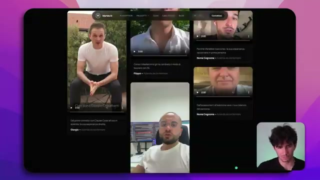

> Poi il resto. Questa pagina in realtà è perfetta. La parte dei prodotti. Questa mi piace. Metterei qui già l'animazione che è presente qui. Anche questa pagina mi sembra che va alla grande. E Engineering as a Service carino. Ci aggiungerei anche qua qualche altra animazione. Qua Casi Studio anche andiamo alla grande.

## [00:24:59] Schermata 53 _(scene)_

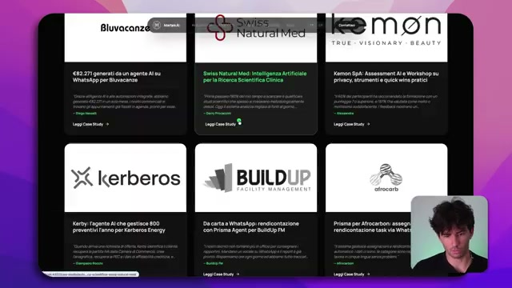

> Il blog andiamo alla grande. E quindi diciamo che. Dopo aver visto questo caso d'uso. Volevo dire anche un'altra cosa. E cioè che. Diffidate di quello che vedete online. Quando dicono. Con un prompt. Ho fatto un sito. O un'applicazione assurda. No. Comunque ricordiamoci. Il modello è super capace. Ma come diceva l'ingegnere di Antropic. Il collo di bottiglia è la persona che c'è qua dietro. Ad esempio. Queste box.

## [00:25:27] Schermata 54 _(scene)_

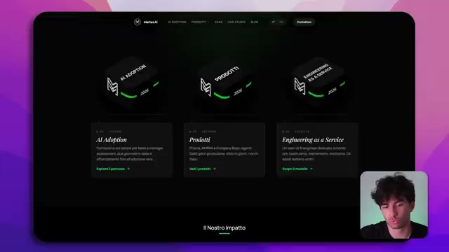

> Glielo ho date io. Le ho generate con CiaGPT. Piuttosto che. Comunque gli ho detto di utilizzare la skill front end slides. Scusate front end design. Per generare le presentazioni.

## [00:25:39] Schermata 55 _(scene)_

> Tutte le. La parte di UI. Evitando. I slope. Quindi io. Non ci credo. Quando vedo le persone. Con un prompt. Costruiscono tutta una cosa. Semplicemente. Abbiamo un modello estremamente capace. Che. Utilizzato con un metodo. Ci velocizza tantissimo. Ma comunque. Da parte nostra. Dobbiamo sapere dare le giuste indicazioni. E dobbiamo sapere sfruttare al massimo. Quindi questo. Era la. Mega parentesi che volevo fare. Bene.

## [00:26:02] Schermata 56 _(scene)_

**Testo a schermo (OCR):** Iltuo Partner AI a360 Gradi.

> Quindi quello che farò adesso io. È un po di andrivieni. Per. Fixare le ultime cose. Comunque devo dire che. In one shot. È quasi tutto perfetto. Ed è stato un rimodellamento. Di tutto il sito. Adesso si tratta semplicemente. Che ne so. Queste card. Di renderle. Interattive. E qualche animazioncina. Qui là. Quindi mi aspetto. Tre quattro interazioni. Il sito. Poi può andare live. Questo è. Secondo me.

## [00:26:23] Schermata 57 _(scene)_

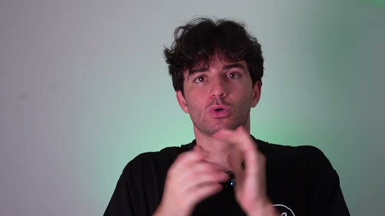

> Il modo migliore. Per utilizzare Fable. Specialmente perché adesso. Ce lo leveranno. Quindi. Piccolo recap. Possiamo sfruttare. Fable. Per fare. Molto più di un piano. Cioè ci permette di. Trovare tutte quelle falle. Quelle problematiche. Quelle cose a cui non avevamo pensato. Che avevamo dato per scontato. Per poi. Dare la strada. Completamente spianata. A un modello come Opus. Di frontiera. Quindi. Questo. Era tutto ciò che volevo dirvi. Come al solito. Se sei un'azienda. E vuoi implementare. L'intelligenza artificiale. All'interno della tua realtà. A partire. Dalla formazione del tuo team. Su strumenti pratici. Come. Cloud Code. Cloud Cowork. Costruzione di un second brain. O anche. Di un company brain. Come vediamo qua. Il nostro nuovo prodotto. Dentro la tua realtà. Per poi. Andare a costruire. Queste implementazioni. Che troviamo insieme. Se è la cosa che ti interessa. Trovi qui sotto in descrizione. Il link. Per. Pronotare una breve chiamata. Dove riusciremo a parlare. Del tuo progetto. Questo è tutto. Fatemi sapere qui sotto. Che ne pensate. E se avete usato Fable. E se.

## [00:27:23] Schermata 58 _(periodic)_

